# Data profiling

```{r}
#| include: false
library(yulab.utils)
Biocpkg <- yulab.utils::Biocpkg
```

The datasets _CBX6_ and _CBX7_ in this vignettes were downloaded 
from _GEO (GSE40740)_[@pemberton_genome-wide_2014] while _ARmo\_0M_, _ARmo\_1nM_ and _ARmo\_100nM_ were 
downloaded from _GEO (GSE48308)_[@urbanucci_overexpression_2012] . 
`r Biocpkg("ChIPseeker")` provides `readPeakFile` to load the peak and store in `GRanges` object.

```{r}
#| label: peak-load

library(epiSeeker)

files <- getSampleFiles()
print(files)
peak <- readPeakFile(files[[4]])
peak
```


## Coverage plot

After peak calling, we would like to know the peak locations over the whole genome, `plotCov` function calculates the 
coverage of peak regions over chromosomes and generate a figure to visualize. 
[GRangesList](https://guangchuangyu.github.io/2016/02/covplot-supports-grangeslist) is also 
supported and can be used to compare coverage of multiple bed files.

```{r}
#| label: plot-coverage
#| eval: false
plotCov(peak, weightCol="V5")
```

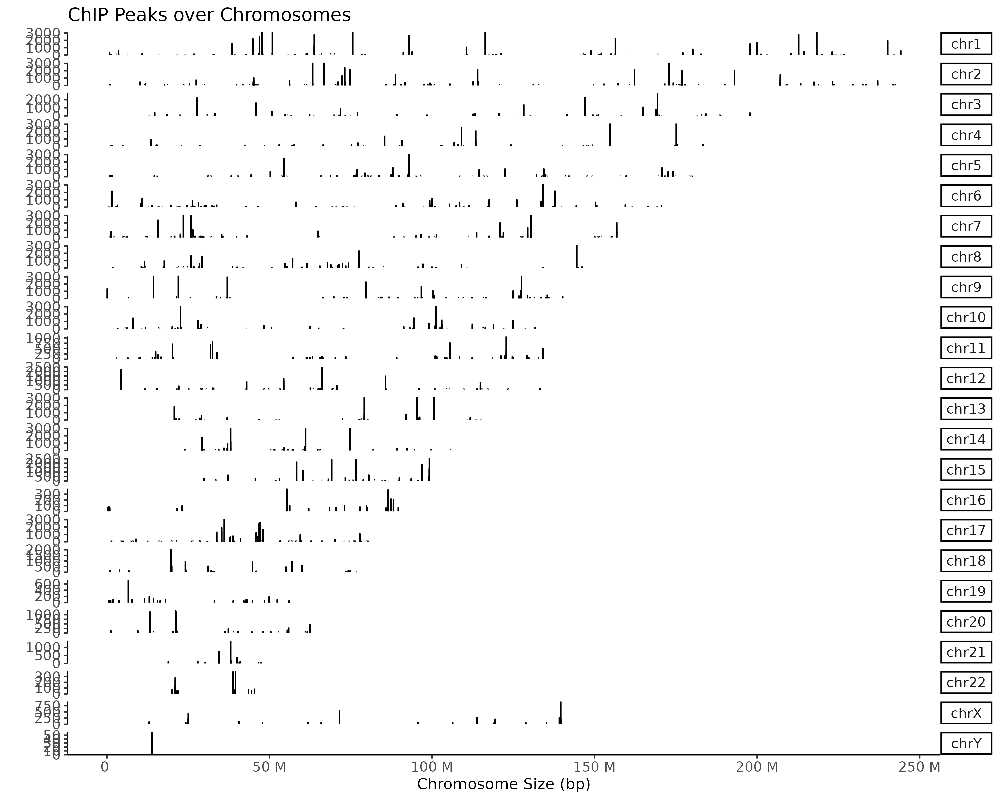{.center}

Interactive function is also supported by epiSeeker. When the user hovers the mouse over the corresponding element, 
it can display the position and value of the peak.

```{r}
#| label: fig-cov-subchr
#| fig-height: 6
#| fig-width: 10
plotCov(peak, weightCol="V5", chrs=c("chr17", "chr18"), xlim=c(4.5e7, 5e7), interactive = TRUE)
```

Hierarchical clustering and co-accessibility relationships and will emerge in the process of analyzing the 
peak coverage of multiple samples. Here we provide function to plot the hierarchical clustering tree based on the input peak data. 
Co-accessibility is also supported to be visualized in the picture by showing the peak pairs with the highest positive correlation 
scores and the highest negative correlation scores.

```{r}
#| label: plot-pancancer
#| eval: false

# Details of the dataset and pre-processing we used here can be found from xxxx
# We only show usage here for demonstration
pancancer_atac <- readRDS("./data/pancancer_atac.rds")

fill_color <- c("#a10589", "#fce364", "#854d23", "#c0b742",
                "#1c670d", "#3ec486", "#f7bbff", "#ee0700",
                "#172ec5", "#f56103", "#3f3a95", "#7a7875",
                "#e06cdc", "#7effff", "#f9b250", "#af1e18",
                "#997f69", "#9d82ed", "#40bcf5", "#f28582",
                "#97be8c", "#7b2ed0", "#81f75b")

design <- "AAAB
           AAAB
           AAAB
           CCC#"

atac_p <- plotCov(pancancer_atac, weightCol = "V5", 
                  chrs = "chr8", title = "",
                  xlim = c(126712193, 128412193),
                  xlab = "", fill_col = fill_color,
                  legend_position = 'none', facet_var = ".id~.",
                  add_cluster_tree = TRUE,
                  add_coaccess = TRUE,
                  design = design)

```

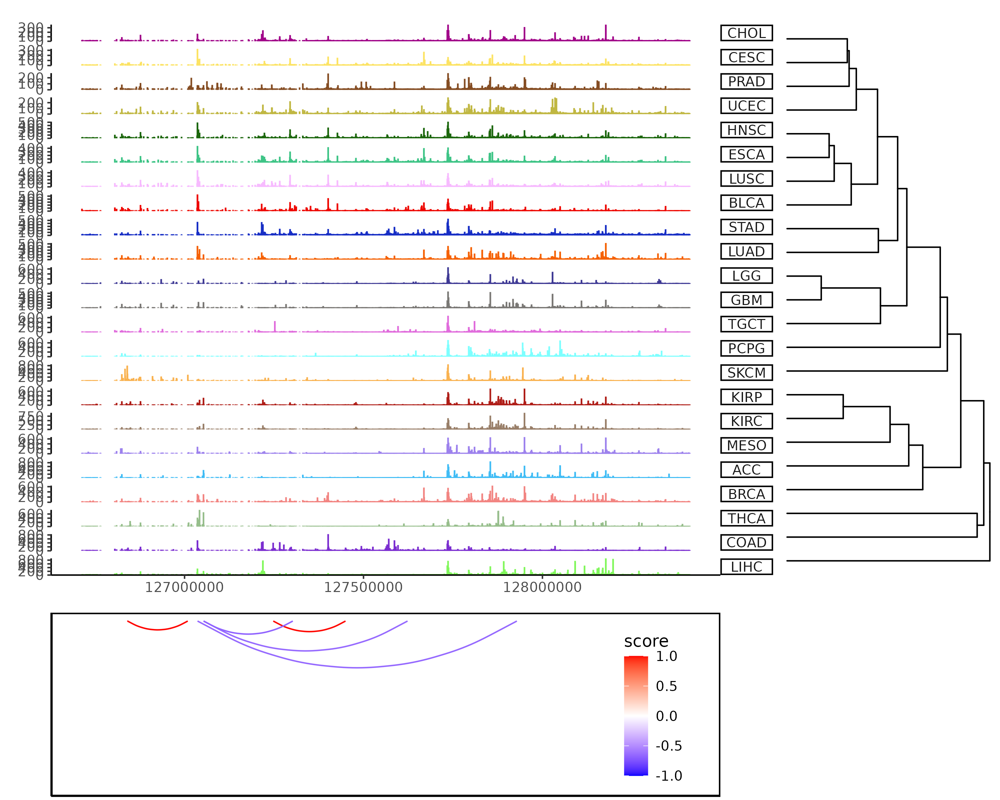{.center}


When `peak` is a `GRangsList` object, user can set the colors directly or by passing a palette to `fill_color`.

```{r}
#| label: plot-Cov-list
#| eval: false
peaks <- lapply(files[4:5], readPeakFile)

plotCov(peaks, weightCol = "V5", fill_color = c("red","blue")) +
  theme(legend.position = "inside",
        legend.position.inside = c(0.8,0.2))
```

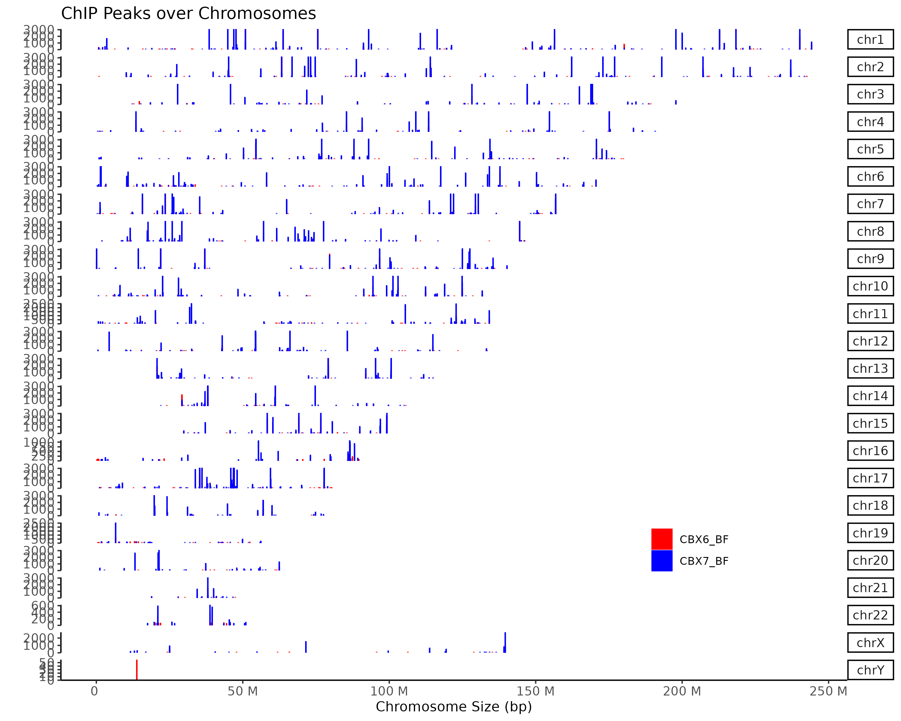{.center}


## Profile of data in specific regions

First of all, for calculating the profile of data in specific region, we should align the data that are mapping to these regions, 
and generate the tagMatrix. Following parameters control what kinds of matrix can be derived.

1. Region parameters:  two parameters to control which region to plot: (1) `by`: users can select one of gene, 
transcript, exon, intron, 3UTR, 5UTR, and UTR. This parameter control which type of region to be showed. 
(2) `type`: users can select one of  start_site, end_site and body. 
This parameter controls the start site or end site or body region to be showed. 

2. Mode parameters: users can use two modes to get the tagMatrix: (1) normal mode: each region of interest will be visualized by 
original resolution, which means one figure in the picture represents one base pairs in the genome. 
(2) binning mode: Users can input `nbin` parameter to turn on this mode, each region of interest will be visualized in a binning 
resolution, which means one point in the figure may represent several base pairs(e.g. 100 bp). Using this mode can speed up the function. 
The most important is that if users select the body region to visualize, binning mode is necessary to align all the body region.

3. Extension parameters: we provides `upstream` and `downstream` parameters to extend the region of interest. 
If we want to visualize the gene region, start_site mode will return region of (TSS – upstream, TSS + downstream), 
end_site mode will return region of (TES –upstream, TES + downstream), 
and body mode will region region of (TSS – upstream, TES + downstream). 
If user select body mode, upstream and downstream parameters can also be a rel object(e.g. rel(0.2)), 
which means upstream and downstream parameter be length(region) * 0.2.

4. Reference parameters: users can input `TxDb` object as reference. 
If users do not want to methods above to get the region of interest, users can provide a granges through windows parameters.

Since tagMatrix has been derived, epiSeeker provide two functions to visualize it: 
(1) `plotPeakProfile()` function: visualize tagMatrix in a line graph. 
(2)`plotPeakHeatmap()` function: visualize the tagMatrix in a heatmap. 
We also provide `plot_prof` parameter in `plotPeakHeatmap()` that can plot the line graph and heatmap in a figure.

There are two crucial mode in visualizing tagMatrix. 
(1) `missingDataAsZero`: this parameter determine how to treat the area that do not have signal. 
For example, users specific a region of 6,000 bp, but the peak only have a region of 200 bp, the rest region is the missing data. 
If `missingDataAsZero` is TRUE, then all the missing value will be set to 0. 
If this value is FALSE, then the missing value will be NULL, and will be filtered in the following visualization. 
(2) `statistic_method` : tagMatrix is a matrix that contains many regions of the same type, for example, all the TSS region. 
`statistic_method` parameter determine how to combine these regions in the figure. 
We use mean method as default, which means we will calculate the mean signal of each point.


### Profile of one sample of one reference region

Here we show the usage of one sample. `by = "transcript"` means we visualize data in transcript region. 
`type = "start_site"` means plot the start site region, here is the transcript start site(TSS).
`upstream = 3000, downstream = 3000` means the extension of start site, here is the region of (TSS - 3000 bp, TSS + 3000 bp).

`plotPeakHeatmap()` can be used to visualize the tagMatrix, with `plot_prof` can plot the heatmap and line graph in a single figure.
`statistic_method = "mean"` means that this function aggregate multiple region by mean methods.
`missingDataAsZero = TRUE` means that we treat missing data as zero that will not be filtered in the following analysis.
`conf = 0.95, resample = 1000` means in the line plot using 95% confidence interval and resample 1000 times.

```{r}
#| label: plot-one-sample-TSS-ref
#| eval: false
tssTagMatrix <- getTagMatrix(peak = peak, upstream = 3000, downstream = 3000, weightCol = "V5",
                             type = "start_site", by = "transcript", TxDb = txdb)

# plot_prof = FALSE will plot only heatmap
plotPeakHeatmap(tssTagMatrix, plot_prof = TRUE,
                statistic_method = "mean",
                missingDataAsZero = TRUE, 
                conf = 0.95, resample = 1000)
```

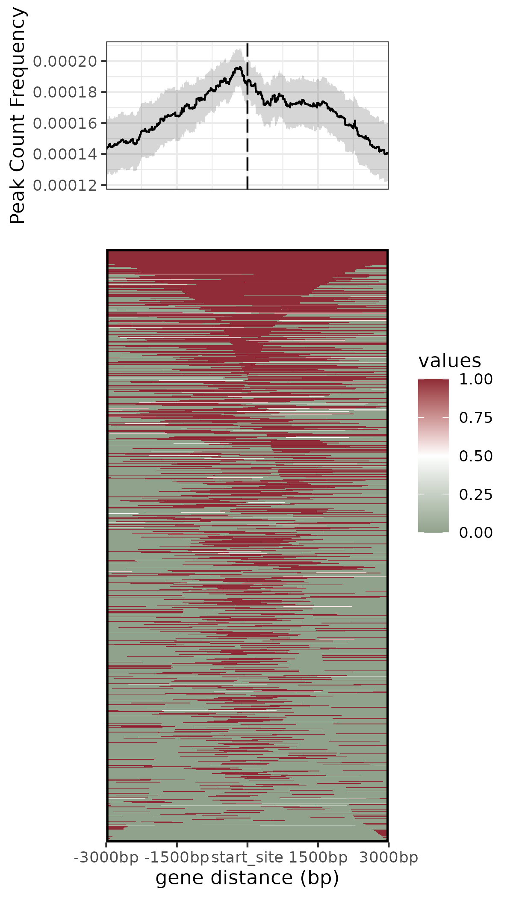{.center}


If users want to plot line graph only, can use `plotPeakProf()` to plot.

```{r}
#| label: plot-one-sample-TSS-resample
#| eval: false
plotPeakProf(tssTagMatrix, conf = 0.95, resample = 1000)
```

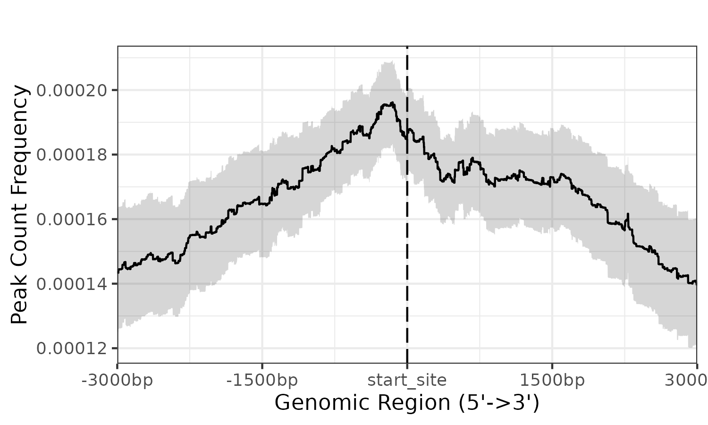{.center}


If users want to speed up function, users can use `nbin` parameter. 
Using binning mode `nbin = 1000` to plot TSS region of 6000 bp, this means a point in figure represents 6 bp in genomic.
```{r}
#| label: plot-one-sample-TSS-nbin
#| eval: false

tssTagMatrix_nbin <- getTagMatrix(peak = peak, upstream = 3000, downstream = 3000, 
                                  weightCol = "V5",
                                  nbin = 1000, # set nbin paramter to turn on binning mode
                                  type = "start_site", by = "transcript", 
                                  TxDb = txdb)

plotPeakHeatmap(tssTagMatrix_nbin, plot_prof = TRUE,
                statistic_method = "mean",
                missingDataAsZero = TRUE, 
                conf = 0.95, resample = 1000)
```

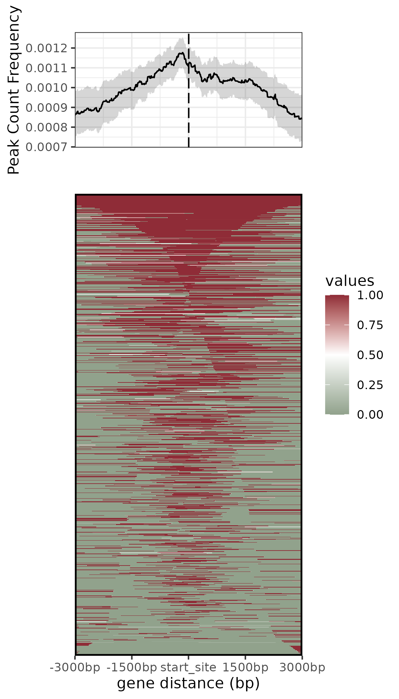{.center}


Body region is an important region to be analyzed, users can select body region through `type` parameter.

In this example, show the visualization of gene body region with actual number(3000 bp) extension.
```{r}
#| label: plot-one-sample-genebody
#| eval: false

geneBodyTagMatrix <- getTagMatrix(peak = peak, 
                                  upstream = 3000, downstream = 3000, 
                                  weightCol = "V5", type = "body", 
                                  by = "gene", TxDb = txdb, nbin = 1000)

plotPeakHeatmap(geneBodyTagMatrix, conf = 0.95)
```


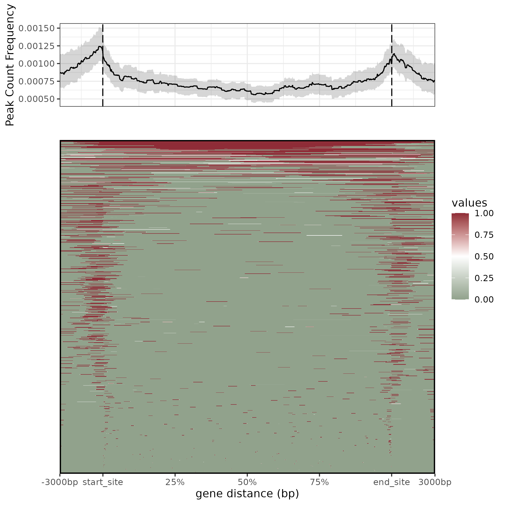{.center}


Extension can also be rel object, here rel(0.2), means the extension is 20% of each gene length.
```{r}
#| label: plot-one-sample-genebody-rel
#| eval: false

geneBodyTagMatrix_rel <- getTagMatrix(peak = peak, 
                                      upstream = rel(0.2), downstream = rel(0.2),
                                      weightCol = "V5", type = "body", 
                                      by = "gene", TxDb = txdb, nbin = 1000)

plotPeakHeatmap(geneBodyTagMatrix_rel, conf = 0.95)
```


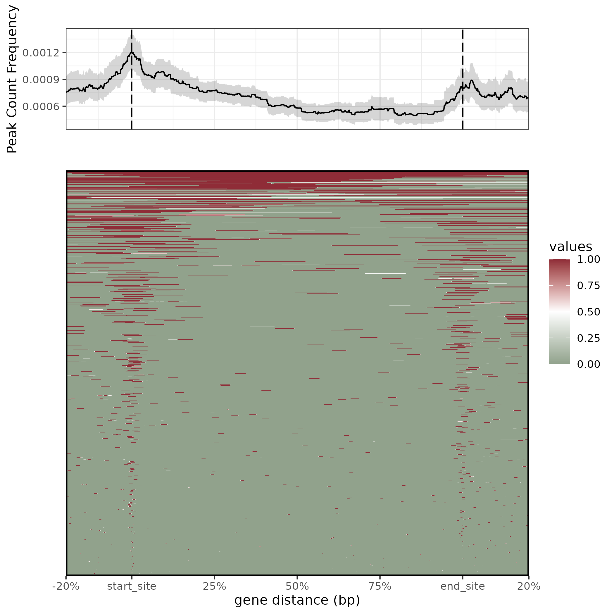{.center}


### Profile of one sample of multiple reference regions

Users can visualize data profile in different types of regions by providing multiple values to `by`. 
This example show the start site region of gene and intron. 

```{r}
#| label: plot-one-sample-multiple-regions
#| eval: false

gene_intron_tssTagMatrix <- getTagMatrix(peak = peak, 
                                         upstream = 3000, downstream = 3000, 
                                         weightCol = "V5",
                                         type = "start_site", 
                                         by = c('gene', 'intron'), TxDb = txdb)

plotPeakHeatmap(gene_intron_tssTagMatrix, conf = 0.95)
```

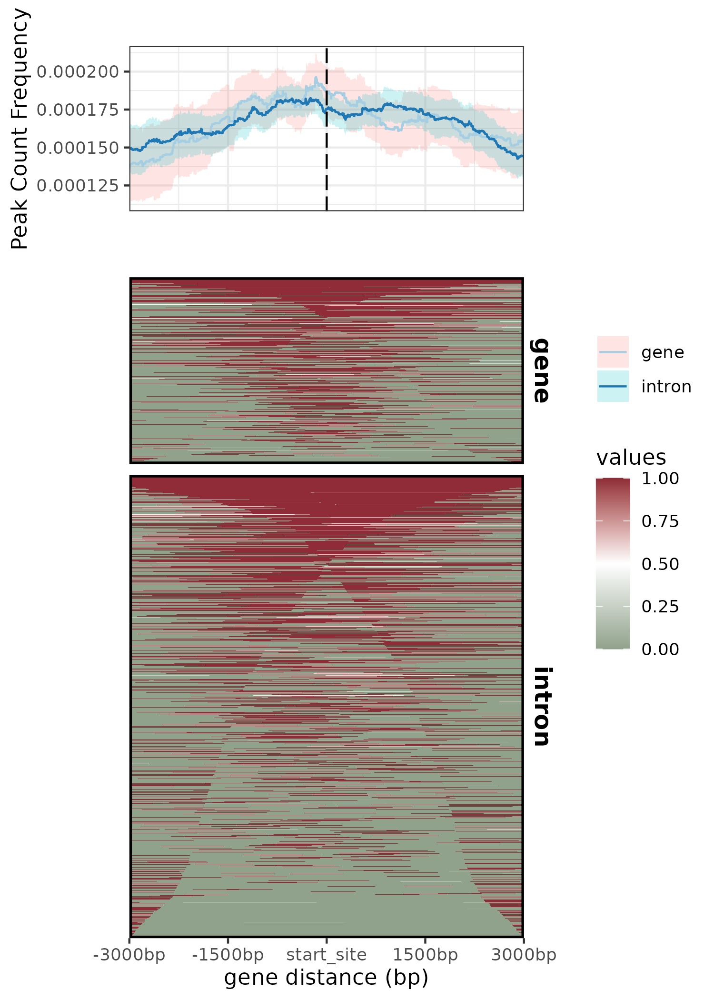{.center}


### Profile of multiple samples of one reference region

Users can input a `GrangeList` object to visualize multiple samples.

```{r}
#| label: plot-multiple-sample-TSS
#| eval: false

tssTagMatrix_list <- getTagMatrix(peak = peaks, 
                                  upstream = 3000, downstream = 3000,
                                  type = "start_site", by = "transcript", 
                                  TxDb = txdb)

plotPeakHeatmap(tssTagMatrix_list, conf = 0.95)
```

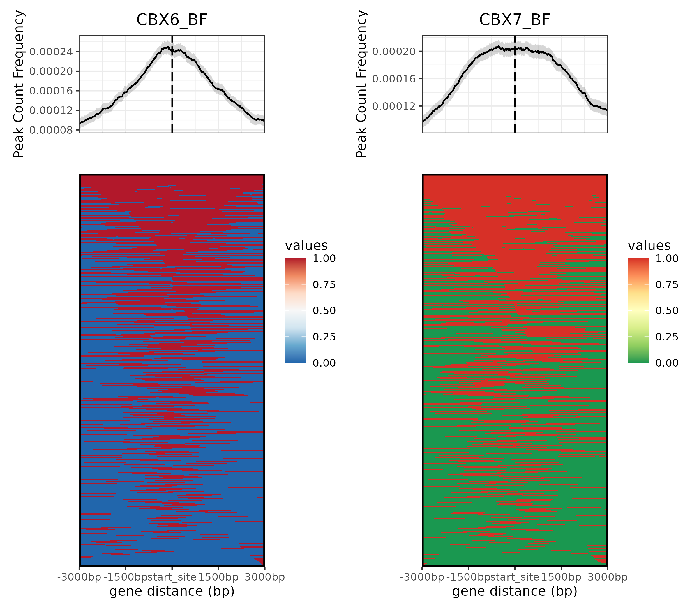{.center}


### Profile of multiple samples of multiple reference regions

Users can input a `GrangeList` object and different values to `by` parameter to profile multiple samples of multiple reference regions.
`peak` parameter in getTagMatrix can not only recept `Grange/GrangeList` object but also bed file path.

```{r}
#| label: plot-multiple-sample-multiple-region
#| eval: false

gene_intron_tssTagMatrix_list <- getTagMatrix(peak = files[4:5], 
                                              upstream = 3000, downstream = 3000, 
                                              weightCol = "V5",
                                              type = "start_site", by = c('gene', 'intron'), TxDb = txdb)
plotPeakHeatmap(gene_intron_tssTagMatrix_list, conf = 0.95)
```

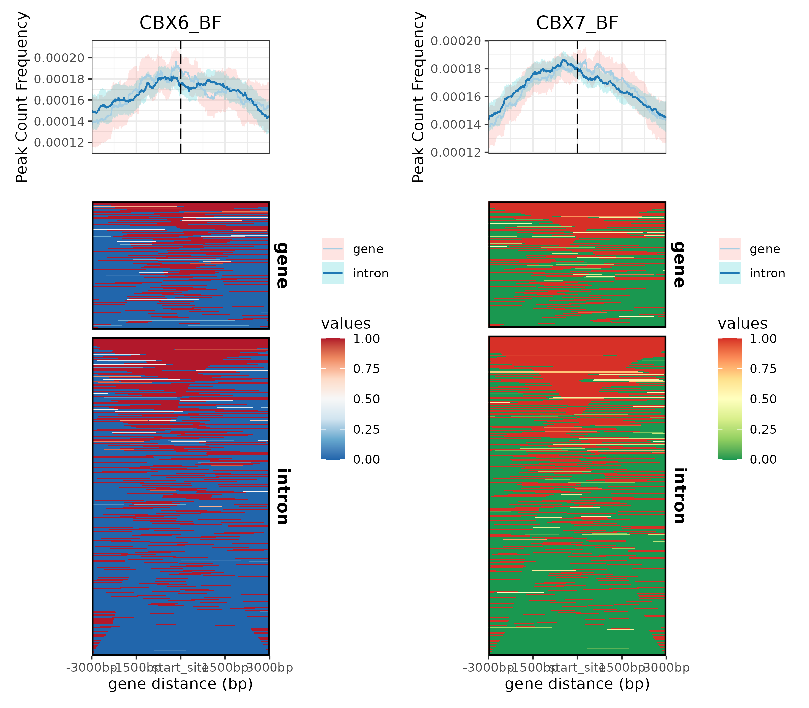{.center}
