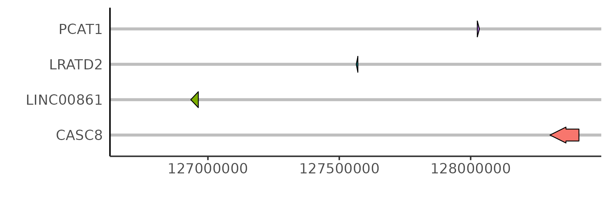

# Visualization of base modification
The datasets of base modification in  this vignettes were downloaded from _GEO (GSE223153)_[@nipper2024tgfbeta]. 
epiSeeker provide `getBmMatrix()` and `plotBmProf()` function to visualize the base modification.
`getBmMatrix()` accept folloing necessary parameters: (1) `region`: region of interset in the format of data frame.
(2) `BSgenome`: sequence reference object. (3) `input`: `BSseq` object or `bmData` object. 
`bmData` object can be constructed by `makeBmDataFromData()` provided by epiSeeker.
(4) `base` : type of base that has modification. (5) `motif`: motif to be analyzed.

```{r}
#| label: bm-profile
#| fig-height: 10
#| fig-width: 15
#| fig-align: center

library(epiSeeker)
library(BSgenome.Hsapiens.UCSC.hg38)

data(demo_bmdata)
bmMatrix <- getBmMatrix(region = data.frame(chr = "chr22", start = 10525991, end = 10526342),
                        BSgenome = BSgenome.Hsapiens.UCSC.hg38,
                        input = demo_bmdata,
                        base = "C",
                        motif = c("CG"))

# Interactive function is also supported by interactive parameter
plotBmProf(bmMatrix, interactive = TRUE)
# htmlwidgets::saveWidget(p, "base_modification.html")
```

# Visualization of gene track
Gene information can be added to visualization result produced by epiSeeker in the form of a track.
`plotGeneTrack()` accepts several parameters to plot gene track: (1) `txdb`: Gene annotation object, txdb object.
(2) `chr,start_pos,end_pos` : region inforamtion to specify which region to plot.
(3) `OrgDb`: annotation object to change gene id.
```{r}
#| label: plotGeneTrack
#| eval: false

library(org.Hs.eg.db)
library(TxDb.Hsapiens.UCSC.hg38.knownGene)
txdb <- TxDb.Hsapiens.UCSC.hg38.knownGene

# this region is the same as the region of pancancer figure
plotGeneTrack(txdb = txdb, chr = "chr8", start_pos = 126712193, 
              end_pos = 128412193, OrgDb = "org.Hs.eg.db")
```

{.center}


Users can also input `select_gene` to visualize gene of interest instead of all genes.
```{r}
#| label: plotGeneTrack-select-gene
#| eval: false
plotGeneTrack(txdb = txdb, chr = "chr8", start_pos = 126712193, 
              end_pos = 128412193, OrgDb = "org.Hs.eg.db",
              select_gene = c("PCAT1","CASC8"))
```


# Visualization of motif
epiSeeker provide functions to visualize the motif in a specific region.
Users should input a `Granges` object to `region` to specify the region.
Sequence reference and motif reference are also necessary.

```{r}
#| label: motif-analysis
#| fig-height: 8
#| fig-width: 12
#| fig-align: center

# motif reference of position-specific weight matrix
# opts_base <- list()
# opts_base[["collection"]] <- "CORE"
# opts_base[["all_versions"]] <- FALSE
# opts_human <- opts_base
# opts_human[["species"]] <- "Homo sapiens"
# opts_human[["tax_group"]] <- "vertebrates"
# sq24 <- RSQLite::dbConnect(RSQLite::SQLite(), JASPAR2024::db(JASPAR2024::JASPAR2024()))
# pwm_obj <- TFBSTools::getMatrixSet(sq24, opts_human)

data(pwm_obj)
motifMatrix <- getMotifMatrix(region = GRanges(seqnames = "chr22",
                                               ranges = IRanges(start = 10525891, end = 10525991)), 
                              pwm = pwm_obj, ref_obj = BSgenome.Hsapiens.UCSC.hg38)

# Interactive function is also supported by interactive parameter
plotMotifProf(motifMatrix, interactive = TRUE)                             
```
