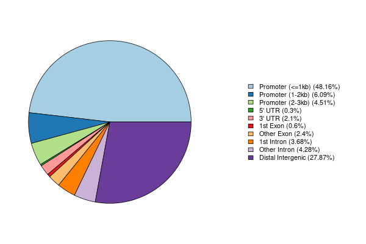
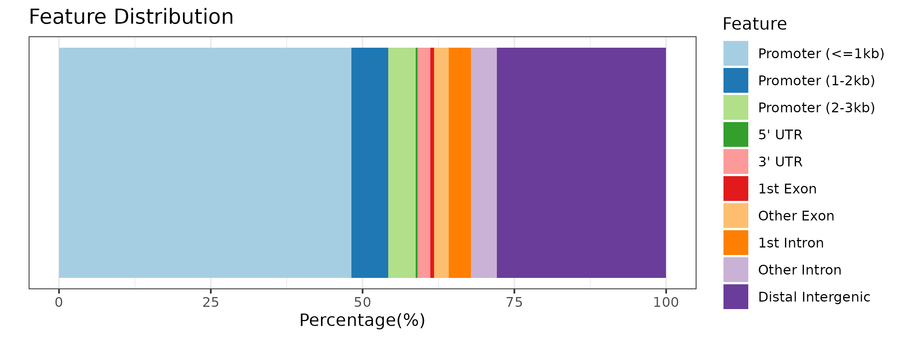
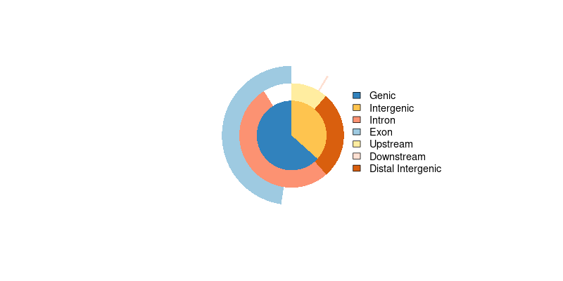
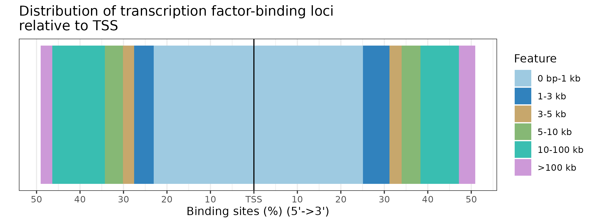

# Peak Annotation
```{r eval = FALSE}
peakAnno <- annotateSeq(files[[4]], tssRegion=c(-3000, 3000),
                         TxDb=txdb, annoDb="org.Hs.eg.db")
```

Note that it would also be possible to use Ensembl-based `EnsDb` annotation 
databases created by the `r Biocpkg("ensembldb")` package for the
peak annotations by providing it with the `TxDb` parameter. Since UCSC-style 
chromosome names are used we have to change the style of the chromosome names
from *Ensembl* to *UCSC* in the example below.

```{r, eval = FALSE}
library(EnsDb.Hsapiens.v75)
edb <- EnsDb.Hsapiens.v75
seqlevelsStyle(edb) <- "UCSC"

peakAnno.edb <- annotateSeq(files[[4]], tssRegion=c(-3000, 3000),
                             TxDb=edb, annoDb="org.Hs.eg.db")
```

Peak Annotation is performed by `annotateSeq`. User can define TSS (transcription start site) region, 
by default TSS is defined from -3kb to +3kb. The output of `annotateSeq` is `csAnno` instance. 
`r Biocpkg("ChIPseeker")` provides `as.GRanges` to convert `csAnno` to `GRanges` instance, 
and `as.data.frame` to convert `csAnno` to `data.frame` which can be exported to file by `write.table`.

`TxDb` object contained transcript-related features of a particular genome. 
Bioconductor provides several package that containing `TxDb` object of model organisms with multiple commonly used genome version, 
for instance `r Biocannopkg("TxDb.Hsapiens.UCSC.hg38.knownGene")`, `r Biocannopkg("TxDb.Hsapiens.UCSC.hg19.knownGene")` for 
human genome hg38 and hg19, `r Biocannopkg("TxDb.Mmusculus.UCSC.mm10.knownGene")` and 
`r Biocannopkg("TxDb.Mmusculus.UCSC.mm9.knownGene")` for 
mouse genome mm10 and mm9, etc. User can also prepare their own `TxDb` object by retrieving information from UCSC Genome Bioinformatics 
and BioMart data resources by R function `makeTxDbFromBiomart` and `makeTxDbFromUCSC`. 
`TxDb` object should be passed for peak annotation.

All the peak information contained in peakfile will be retained in the output of `annotateSeq`. 
The position and strand information of nearest genes are reported. 
The distance from peak to the TSS of its nearest gene is also reported. 
The genomic region of the peak is reported in annotation column. 
Since some annotation may overlap, `r Biocpkg("ChIPseeker")` adopted the following priority in genomic annotation.

* Promoter
* 5' UTR
* 3' UTR
* Exon
* Intron
* Downstream
* Intergenic


_Downstream_ is defined as the downstream of gene end.

`r Biocpkg("ChIPseeker")` also provides parameter _genomicAnnotationPriority_ for user to prioritize this hierachy.

`annotateSeq` report detail information when the annotation is Exon or Intron, 
for instance "Exon (uc002sbe.3/9736, exon 69 of 80)", means that the peak is overlap with an Exon of transcript uc002sbe.3, 
and the corresponding Entrez gene ID is 9736 (Transcripts that belong to the same gene ID may differ in splice events), 
and this overlaped exon is the 69th exon of the 80 exons that this transcript uc002sbe.3 prossess.

Parameter annoDb is optional, if provided, extra columns including SYMBOL, GENENAME, ENSEMBL/ENTREZID will be added. 
The geneId column in annotation output will be consistent with the geneID in TxDb. 
If it is ENTREZID, ENSEMBL will be added if annoDb is provided, while if it is ENSEMBL ID, ENTREZID will be added.


## Visualize Genomic Annotation

To annotate the location of a given peak in terms of genomic features, `annotateSeq` assigns peaks to genomic annotation 
in "annotation" column of the output, which includes whether a peak is in the TSS, Exon, 5' UTR, 3' UTR, Intronic or Intergenic. 
Many researchers are very interesting in these annotations. TSS region can be defined by user and `annotateSeq` output 
in details of which exon/intron of which genes as illustrated in previous section.

Pie and Bar plot are supported to visualize the genomic annotation.
```{r eval = FALSE}
plotAnnoPie(peakAnno)
```
<div style="text-align: center;">

</div>


```{r eval = FALSE}
plotAnnoBar(peakAnno)
```
<div style="text-align: center;">

</div>

Since some annotation overlap, user may interested to view the full annotation with their overlap, 
which can be partially resolved by `vennpie` function.

```{r eval = FALSE}
vennpie(peakAnno)
```
<div style="text-align: center;">

</div>

We extend `r CRANpkg("UpSetR")` to view full annotation overlap. User can user `upsetplot` function.

```{r fig.cap="Genomic Annotation by upsetplot", fig.align="center", fig.height=8, fig.width=12}
upsetplot(peakAnno, vennpie=TRUE)
```


## Visualize distribution of TF-binding loci relative to TSS

The distance from the peak (binding site) to the TSS of the nearest gene is calculated by `annotateSeq` and 
reported in the output. We provide `plotDistToTSS` to calculate the percentage of binding sites upstream and 
downstream from the TSS of the nearest genes, and visualize the distribution.

```{r eval = FALSE}
plotDistToTSS(peakAnno,
              title="Distribution of transcription factor-binding loci\nrelative to TSS")
```
<div style="text-align: center;">

</div>