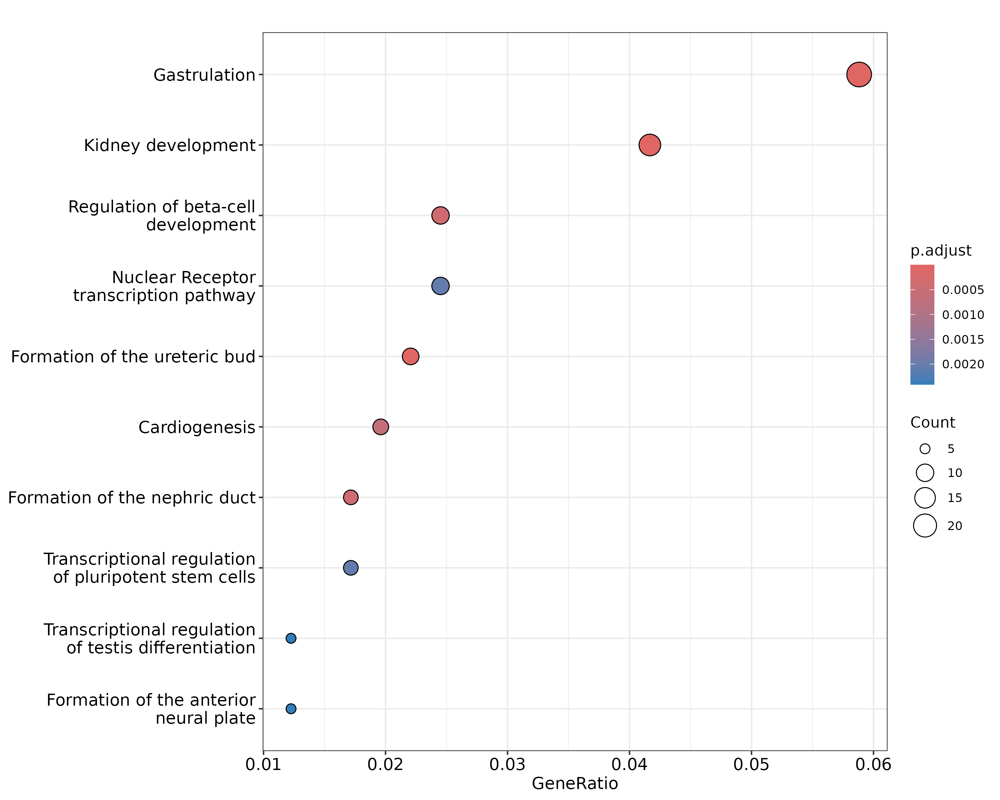

# Functional enrichment analysis

```{r}
#| include: false
library(epiSeeker)
library(yulab.utils)
Biocpkg <- yulab.utils::Biocpkg

```

Once we have obtained the annotated nearest genes, we can perform functional enrichment analysis to 
identify predominant biological themes among these genes by incorporating biological knowledge provided by biological ontologies. 
For instance, Gene Ontology (GO)[@ashburner_gene_2000] annotates genes to biological processes, molecular functions, 
and cellular components in a directed acyclic graph structure, 
Kyoto Encyclopedia of Genes and Genomes (KEGG)[@kanehisa_kegg_2004] annotates genes to pathways, 
Disease Ontology (DO)[@schriml_disease_2011] annotates genes with human disease association, 
and Reactome[@croft_reactome_2013] annotates gene to pathways and reactions.

`r Biocpkg("ChIPseeker")` also provides a function, __*seq2gene*__, for linking genomc regions to genes in a many-to-many mapping. 
It consider host gene (exon/intron), promoter region and flanking gene from intergenic region that may under control via cis-regulation. 
This function is designed to link both coding and non-coding genomic regions to coding genes and facilitate functional analysis.


Enrichment analysis is a widely used approach to identify biological themes. 
I have developed several Bioconductor packages for investigating whether the number of selected genes 
associated with a particular biological term is larger than expected, 
including `r Biocpkg("DOSE")`[@yu_dose_2015] for Disease Ontology, `r Biocpkg("ReactomePA")` for reactome pathway, 
`r Biocpkg("clusterProfiler")`[@yu_clusterprofiler_2012] for Gene Ontology and KEGG enrichment analysis.

```{r}
#| label: enrichPathway
#| eval: false
library(ReactomePA)

pathway1 <- enrichPathway(as.data.frame(peakAnno)$geneId)
head(pathway1, 2)
##                          ID        Description GeneRatio   BgRatio RichFactor
## R-HSA-9830369 R-HSA-9830369 Kidney development    19/506  46/11214  0.4130435
## R-HSA-9758941 R-HSA-9758941       Gastrulation    27/506 115/11214  0.2347826
##               FoldEnrichment    zScore       pvalue     p.adjust       qvalue
## R-HSA-9830369       9.153892 12.045870 2.601506e-14 2.796619e-11 2.760335e-11
## R-HSA-9758941       5.203265  9.848629 8.375539e-13 4.501852e-10 4.443444e-10
##                                                                                                                                                   geneID
## R-HSA-9830369                                          2625/5076/7490/652/6495/2303/3975/6928/10736/5455/7849/3237/6092/2122/255743/2296/3400/28514/2138
## R-HSA-9758941 5453/5692/5076/5080/7546/3169/652/5015/2303/5717/3975/2627/5714/344022/7849/5077/2637/7022/8320/7545/6657/4487/51176/2296/28514/2626/64321
##               Count
## R-HSA-9830369    19
## R-HSA-9758941    27

gene <- seq2gene(peak, tssRegion = c(-1000, 1000), flankDistance = 3000, TxDb=txdb)
pathway2 <- enrichPathway(gene)
head(pathway2, 2)
##                          ID        Description GeneRatio   BgRatio RichFactor
## R-HSA-9830369 R-HSA-9830369 Kidney development    17/415  46/11214  0.3695652
## R-HSA-9758941 R-HSA-9758941       Gastrulation    24/415 115/11214  0.2086957
##               FoldEnrichment    zScore       pvalue     p.adjust       qvalue
## R-HSA-9830369       9.986276 11.971929 2.162576e-13 2.175552e-10 2.114772e-10
## R-HSA-9758941       5.639309  9.802874 3.528656e-12 1.774914e-09 1.725327e-09
##                                                                                                                                    geneID
## R-HSA-9830369                                      2625/5076/3227/652/6495/2303/3975/3237/6092/2122/255743/7490/6928/7849/5455/2296/28514
## R-HSA-9758941 5453/5692/5076/7546/3169/652/2303/5717/3975/2627/5714/344022/2637/8320/7545/7020/2626/5080/5015/7849/51176/2296/64321/28514
##               Count
## R-HSA-9830369    17
## R-HSA-9758941    24

dotplot(pathway2)
```

{.center}

More information can be found in the vignettes of Bioconductor packages `r Biocpkg("DOSE")`[@yu_dose_2015], `r Biocpkg("ReactomePA")`, 
`r Biocpkg("clusterProfiler")`[@yu_clusterprofiler_2012], which also provide several methods to visualize enrichment results. 
The `r Biocpkg("clusterProfiler")`[@yu_clusterprofiler_2012] is designed for comparing and visualizing functional profiles 
among gene clusters, and can directly applied to compare biological themes at GO, DO, KEGG, Reactome perspective.
