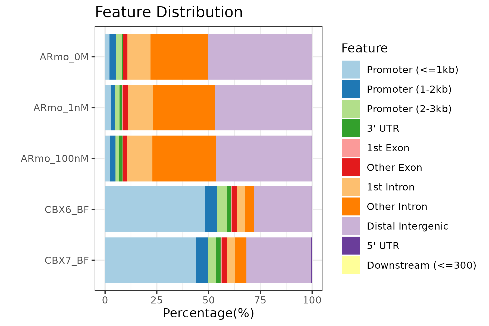
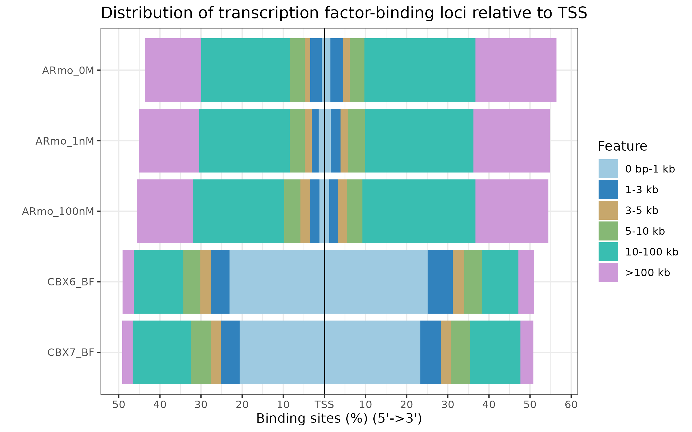
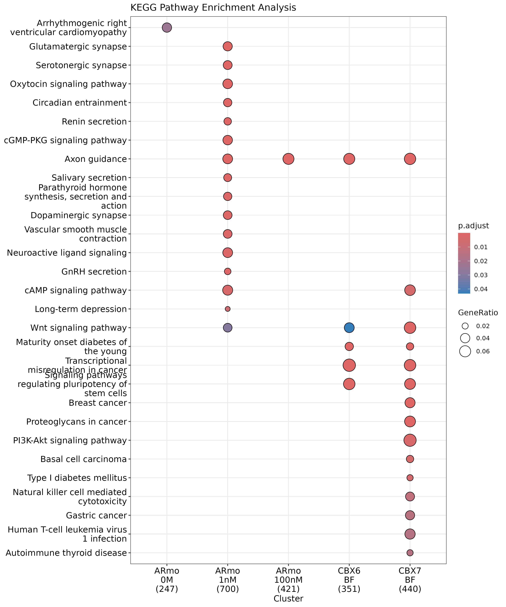
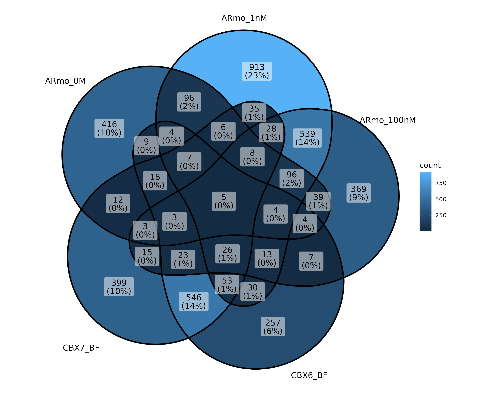

# ChIP peak data set comparison

## ChIP peak annotation comparision
The `plotAnnoBar` and `plotDistToTSS` can also accept input of a named list of annotated peaks (output of `annotateSeq`).

```{r, eval = FALSE}
peakAnnoList <- lapply(files, annotateSeq, TxDb=txdb,
                       tssRegion=c(-3000, 3000), verbose=FALSE)
```

We can use `plotAnnoBar` to comparing their genomic annotation.
```{r eval = FALSE}
plotAnnoBar(peakAnnoList)
```

<div style="text-align: center;">

</div>


R function `plotDistToTSS` can use to comparing distance to TSS profiles among ChIPseq data.
```{r eval = FALSE}
plotDistToTSS(peakAnnoList)
```

<div style="text-align: center;">

</div>

## Functional profiles comparison
As shown in section 4, the annotated genes can analyzed by `r
Biocpkg("clusterProfiler")`[@yu_clusterprofiler_2012], `r
Biocpkg("DOSE")`[@yu_dose_2015], `r Biocpkg("meshes")` and `r
Biocpkg("ReactomePA")` for Gene Ontology, KEGG, Disease Ontology, MeSH and Reactome Pathway enrichment analysis.

The `r Biocpkg("clusterProfiler")`[@yu_clusterprofiler_2012] package provides `compareCluster` function for comparing biological themes 
among gene clusters, and can be easily adopted to compare different ChIP peak experiments.

```{r eval = FALSE}
genes <- lapply(peakAnnoList, function(i) as.data.frame(i)$geneId)
names(genes) <- sub("_", "\n", names(genes))
compKEGG <- compareCluster(geneCluster   = genes,
                           fun           = "enrichKEGG",
                           pvalueCutoff  = 0.05,
                           pAdjustMethod = "BH")
dotplot(compKEGG, showCategory = 15, title = "KEGG Pathway Enrichment Analysis")
```


## Overlap of peaks and annotated genes

User may want to compare the overlap peaks of replicate experiments or from different experiments. 
`r Biocpkg("ChIPseeker")` provides `peak2GRanges` that can read peak file and stored in GRanges object. 
Several files can be read simultaneously using lapply, and then passed to `vennplot` to calculate their overlap and draw venn plot.

`vennplot` accept a list of object, can be a list of GRanges or a list of vector. 
Here, I will demonstrate using `vennplot` to visualize the overlap of the nearest genes stored in peakAnnoList.

```{r eval = FALSE}
genes <- lapply(peakAnnoList, function(i) as.data.frame(i)$geneId)
vennplot(genes)
```


# Statistical testing of ChIP seq overlap

Overlap is very important, if two ChIP experiment by two different proteins overlap in a large fraction of their peaks, 
they may cooperative in regulation. Calculating the overlap is only touch the surface. 
`r Biocpkg("ChIPseeker")` implemented statistical methods to measure the significance of the overlap.

## Shuffle genome coordination

```{r eval = FALSE}
p <- GRanges(seqnames=c("chr1", "chr3"),
             ranges=IRanges(start=c(1, 100), end=c(50, 130)))
shuffle(p, TxDb=txdb)

## GRanges object with 2 ranges and 0 metadata columns:
##       seqnames              ranges strand
##          <Rle>           <IRanges>  <Rle>
##   [1]     chr1 172715894-172715943      *
##   [2]     chr3   32242432-32242462      *
##   -------
##   seqinfo: 2 sequences from an unspecified genome; no seqlengths
```

We implement the `shuffle` function to randomly permute the genomic locations of ChIP peaks 
defined in a genome which stored in `TxDb` object.


## Peak overlap enrichment analysis

With the ease of this `shuffle` method, we can generate thousands of random ChIP data and 
calculate the background null distribution of the overlap among ChIP data sets.

```{r eval = FALSE}
enrichPeakOverlap(queryPeak     = files[[5]],
                  targetPeak    = unlist(files[1:4]),
                  TxDb          = txdb,
                  pAdjustMethod = "BH",
                  nShuffle      = 50,
                  chainFile     = NULL,
                  verbose       = FALSE)
##                                                       qSample
## ARmo_0M    GSM1295077_CBX7_BF_ChipSeq_mergedReps_peaks.bed.gz
## ARmo_1nM   GSM1295077_CBX7_BF_ChipSeq_mergedReps_peaks.bed.gz
## ARmo_100nM GSM1295077_CBX7_BF_ChipSeq_mergedReps_peaks.bed.gz
## CBX6_BF    GSM1295077_CBX7_BF_ChipSeq_mergedReps_peaks.bed.gz
##                                                       tSample qLen tLen N_OL
## ARmo_0M                       GSM1174480_ARmo_0M_peaks.bed.gz 1663  812    0
## ARmo_1nM                     GSM1174481_ARmo_1nM_peaks.bed.gz 1663 2296    8
## ARmo_100nM                 GSM1174482_ARmo_100nM_peaks.bed.gz 1663 1359    3
## CBX6_BF    GSM1295076_CBX6_BF_ChipSeq_mergedReps_peaks.bed.gz 1663 1331  968
##                pvalue   p.adjust
## ARmo_0M    0.82352941 0.82352941
## ARmo_1nM   0.17647059 0.35294118
## ARmo_100nM 0.33333333 0.44444444
## CBX6_BF    0.01960784 0.07843137
```

Parameter _queryPeak_ is the query ChIP data, while _targetPeak_ is bed file name or a vector of bed file names from comparison; 
_nShuffle_ is the number to shuffle the peaks in _targetPeak_. 
To speed up the compilation of this vignettes, we only set _nShuffle_ to 50 as an example for only demonstration. 
User should set the number to 1000 or above for more robust result. 
Parameter _chainFile_ are chain file name for mapping the _targetPeak_ to the genome version consistent with _queryPeak_ when 
their genome version are different. This creat the possibility of comparison among different genome version and cross species.

In the output, _qSample_ is the name of _queryPeak_ and _qLen_ is the the number of peaks in _queryPeak_. _N\_OL_ is the number of 
overlap between _queryPeak_ and _targetPeak_.