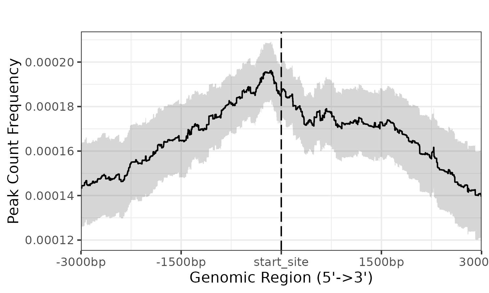

```{r style, echo=FALSE, results='asis', message=FALSE}
knitr::opts_chunk$set(tidy         = FALSE,
                      warning      = FALSE,
                      message      = FALSE)

library(yulab.utils)
Biocannopkg <- yulab.utils::Biocpkg
```

```{r echo=FALSE, results='hide', message=FALSE}
library(GenomicFeatures)
library(GenomicRanges)
library(TxDb.Hsapiens.UCSC.hg19.knownGene)
library(org.Hs.eg.db)
library(ggplot2)
library(clusterProfiler)
library(ReactomePA)
library(epiSeeker)
```

# Abstract

epiSeeker is an R package for analyzing multi-omics epigenetic data. 
Data of fragment type, like ChIP-seq data and ATAC-seq data, are supported by epiSeeker. 
It supports annotating ChIP peaks and provides functions to visualize ChIP peaks coverage over chromosomes and 
profiles of peaks binding to TSS regions. 
Comparison of ChIP peak profiles and annotation are also supported. 
Moreover, it supports evaluating significant overlap among ChIP-seq datasets. 
Currently, it contains 17,000 bed file information from GEO database. 
These datasets can be downloaded and compare with user's own data to explore significant overlap datasets for 
inferring co-regulation or transcription factor complex for further investigation. 
Data of base type, like oxBS‑seq data, are also supported. 
It provides function to visualize single-base resolution epigenetic data by considering the strand, motif, and additional information. 


# Citation

If you use `r Biocpkg("ChIPseeker")`[@yu_chipseeker_2015] in published research, please cite:

+ Q Wang<sup>#</sup>, M Li<sup>#</sup>, T Wu, L Zhan, L Li, M Chen, W Xie, Z Xie, E Hu, S Xu, __G Yu__<sup>\*</sup>. [Exploring epigenomic datasets by ChIPseeker](https://onlinelibrary.wiley.com/share/author/GYJGUBYCTRMYJFN2JFZZ?target=10.1002/cpz1.585). __*Current Protocols*__, 2022, 2(10): e585. 
+ __G Yu__<sup>\*</sup>, LG Wang, QY He<sup>\*</sup>. [ChIPseeker: an R/Bioconductor package for ChIP peak annotation, comparision and visualization](http://bioinformatics.oxfordjournals.org/cgi/content/abstract/btv145). __*Bioinformatics*__. 2015, 31(14):2382-2383. 


# Introduction

Biology relies heavily on epigenetics as a method of altering genetic information without altering nucleic acids. 
Based on the type of epigenomic data can be divided into two types: (1) fragment type, (2) base type.

Chromatin immunoprecipitation followed by high-throughput sequencing (ChIP-seq) is an canonical fragment type data. 
It has become standard technologies for genome wide identification of DNA-binding protein target sites. 
After read mappings and peak callings, the peak should be annotated to answer the biological questions. 
Annotation also create the possibility of integrating expression profile data to predict gene expression regulation. 
`r Biocpkg("ChIPseeker")`[@yu_chipseeker_2015] was developed for annotating nearest genes and genomic features to peaks.
ChIP peak data set comparison is also very important. We can use it as an index to estimate how well biological replications are. 
Even more important is applying to infer cooperative regulation. 
If two ChIP seq data, obtained by two different binding proteins, overlap significantly, 
these two proteins may form a complex or have interaction in regulation chromosome remodelling or gene expression. 
`r Biocpkg("ChIPseeker")`[@yu_chipseeker_2015] support statistical testing of significant overlap among ChIP seq data sets, 
and incorporate open access database GEO for users to compare their own dataset to those deposited in database. 
Protein interaction hypothesis can be generated by mining data deposited in database. 
Converting genome coordinations from one genome version to another is also supported, 
making this comparison available for different genome version and different species.
Several visualization functions are implemented to visualize the coverage of the ChIP seq data, peak annotation, 
average profile and heatmap of peaks binding to TSS region.
Functional enrichment analysis of the peaks can be performed by my Bioconductor packages 
`r Biocpkg("DOSE")`[@yu_dose_2015], `r Biocpkg("ReactomePA")`[@yu_reactomepa_2016], 
`r Biocpkg("clusterProfiler")`[@yu_clusterprofiler_2012].

Epigenomic data of base type refer to epigenomic modification at a single-base resolution. 
Many methods are used to detect the epigenetic status with the combination of sequencing and chemical methods, 
such as `Me‑DIP` and `oxBS‑seq` for `5mC`; `TAB-seq` and `hme‑DIP` for `5hmC`; `6mA‑DIP` and `6mA‑RE-seq` for `6mA`. 
Aside from these, third-generation sequencing methods, which refer to direct single-molecule sequencing, 
such as Oxford Nanopore Sequencing and PacBio SMRT Sequencing.

```{r}
## loading packages
library(epiSeeker)
library(TxDb.Hsapiens.UCSC.hg19.knownGene)
txdb <- TxDb.Hsapiens.UCSC.hg19.knownGene
library(clusterProfiler)
library(BSgenome.Hsapiens.UCSC.hg19)
BSgenome_hg19 <- BSgenome.Hsapiens.UCSC.hg19
library(BSgenome.Dmelanogaster.UCSC.dm6)
library(JASPAR2024)
library(TFBSTools)
library(RSQLite)
```

# Data profiling
The datasets _CBX6_ and _CBX7_ in this vignettes were downloaded 
from _GEO (GSE40740)_[@pemberton_genome-wide_2014] while _ARmo\_0M_, _ARmo\_1nM_ and _ARmo\_100nM_ were 
downloaded from _GEO (GSE48308)_[@urbanucci_overexpression_2012] . 
`r Biocpkg("ChIPseeker")` provides `readPeakFile` to load the peak and store in `GRanges` object.

```{r}
files <- getSampleFiles()
print(files)
peak <- readPeakFile(files[[4]])
peak
```

## Coverage plot

After peak calling, we would like to know the peak locations over the whole genome, `plotCov` function calculates the 
coverage of peak regions over chromosomes and 
generate a figure to visualize. [GRangesList](https://guangchuangyu.github.io/2016/02/covplot-supports-grangeslist) is also 
supported and can be used to compare coverage of multiple bed files.

```{r eval=FALSE}
plotCov(peak, weightCol="V5")
```


Interactive function is also supported by epiSeeker. When the user hovers the mouse over the corresponding element, 
it can display the position and value of the peak.

```{r fig.height=4, fig.width=10}
plotCov(peak, weightCol="V5", chrs=c("chr17", "chr18"), xlim=c(4.5e7, 5e7), interactive = TRUE)
```

Hierarchical clustering and co-accessibility relationships and will emerge in the process of analyzing the 
peak coverage of multiple samples. Here we provide function to plot the hierarchical clustering tree based on the input peak data. 
Co-accessibility is also supported to be visualized in the picture by showing the peak pairs with the highest positive correlation 
scores and the highest negative correlation scores.

```{r eval=FALSE}
# Details of the dataset and pre-processing we used here can be found from xxxx
# We only show usage here for demonstration
pancancer_atac <- readRDS("./data/pancancer_atac.rds")

fill_color <- c("#a10589", "#fce364", "#854d23", "#c0b742",
                "#1c670d", "#3ec486", "#f7bbff", "#ee0700",
                "#172ec5", "#f56103", "#3f3a95", "#7a7875",
                "#e06cdc", "#7effff", "#f9b250", "#af1e18",
                "#997f69", "#9d82ed", "#40bcf5", "#f28582",
                "#97be8c", "#7b2ed0", "#81f75b")

design <- "AAAB
           AAAB
           AAAB
           CCC#"

atac_p <- plotCov(pancancer_atac, weightCol = "V5", 
                  chrs = "chr8", title = "",
                  xlim = c(126712193, 128412193),
                  xlab = "", fill_col = fill_color,
                  legend_position = 'none', facet_var = ".id~.",
                  add_cluster_tree = TRUE,
                  add_coaccess = TRUE,
                  design = design)

```


When `peak` is a `GRangsList` object, user can set the colors directly or by passing a palette to `fill_color`.

```{r fig.height=8, fig.width=10}
peaks <- lapply(files[4:5], readPeakFile)

plotCov(peaks, weightCol = "V5", fill_color = c("red","blue")) +
  theme(legend.position = "inside",
        legend.position.inside = c(0.8,0.2))
```


## Profile of data in specific regions

First of all, for calculating the profile of data in specific region, we should align the data that are mapping to these regions, 
and generate the tagMatrix. Following parameters control what kinds of matrix can be derived.

1. Region parameters:  two parameters to control which region to plot: (1) `by`: users can select one of gene, 
transcript, exon, intron, 3UTR, 5UTR, and UTR. This parameter control which type of region to be showed. 
(2) `type`: users can select one of  start_site, end_site and body. 
This parameter controls the start site or end site or body region to be showed. 

2. Mode parameters: users can use two modes to get the tagMatrix: (1) normal mode: each region of interest will be visualized by 
original resolution, which means one figure in the picture represents one base pairs in the genome. 
(2) binning mode: Users can input `nbin` parameter to turn on this mode, each region of interest will be visualized in a binning 
resolution, which means one point in the figure may represent several base pairs(e.g. 100 bp). Using this mode can speed up the function. 
The most important is that if users select the body region to visualize, binning mode is necessary to align all the body region.

3. Extension parameters: we provides `upstream` and `downstream` parameters to extend the region of interest. 
If we want to visualize the gene region, start_site mode will return region of (TSS – upstream, TSS + downstream), 
end_site mode will return region of (TES –upstream, TES + downstream), 
and body mode will region region of (TSS – upstream, TES + downstream). 
If user select body mode, upstream and downstream parameters can also be a rel object(e.g. rel(0.2)), 
which means upstream and downstream parameter be length(region) * 0.2.

4. Reference parameters: users can input `TxDb` object as reference. 
If users do not want to methods above to get the region of interest, users can provide a granges through windows parameters.

Since tagMatrix has been derived, epiSeeker provide two functions to visualize it: 
(1) `plotPeakProfile()` function: visualize tagMatrix in a line graph. 
(2)`plotPeakHeatmap()` function: visualize the tagMatrix in a heatmap. 
We also provide `plot_prof` parameter in `plotPeakHeatmap()` that can plot the line graph and heatmap in a figure.

There are two crucial mode in visualizing tagMatrix. 
(1) `missingDataAsZero`: this parameter determine how to treat the area that do not have signal. 
For example, users specific a region of 6,000 bp, but the peak only have a region of 200 bp, the rest region is the missing data. 
If `missingDataAsZero` is TRUE, then all the missing value will be set to 0. 
If this value is FALSE, then the missing value will be NULL, and will be filtered in the following visualization. 
(2) `statistic_method` : tagMatrix is a matrix that contains many regions of the same type, for example, all the TSS region. 
`statistic_method` parameter determine how to combine these regions in the figure. 
We use mean method as default, which means we will calculate the mean signal of each point.


### Profile of one sample of one reference region

Here we show the usage of one sample. `by = "transcript"` means we visualize data in transcript region. 
`type = "start_site"` means plot the start site region, here is the transcript start site(TSS).
`upstream = 3000, downstream = 3000` means the extension of start site, here is the region of (TSS - 3000 bp, TSS + 3000 bp).

`plotPeakHeatmap()` can be used to visualize the tagMatrix, with `plot_prof` can plot the heatmap and line graph in a single figure.
`statistic_method = "mean"` means that this function aggregate multiple region by mean methods.
`missingDataAsZero = TRUE` means that we treat missing data as zero that will not be filtered in the following analysis.
`conf = 0.95, resample = 1000` means in the line plot using 95% confidence interval and resample 1000 times.

```{r eval=FALSE}
tssTagMatrix <- getTagMatrix(peak = peak, upstream = 3000, downstream = 3000, weightCol = "V5",
                             type = "start_site", by = "transcript", TxDb = txdb)

# plot_prof = FALSE will plot only heatmap
plotPeakHeatmap(tssTagMatrix, plot_prof = TRUE,
                statistic_method = "mean",
                missingDataAsZero = TRUE, 
                conf = 0.95, resample = 1000)
```


<div style="text-align: center;">
  
</div>

If users want to plot line graph only, can use `plotPeakProf()` to plot.

```{r eval=FALSE}
plotPeakProf(tssTagMatrix, conf = 0.95, resample = 1000)
```
<div style="text-align: center;">
  
</div>


If users want to speed up function, users can use `nbin` parameter. 
Using binning mode `nbin = 1000` to plot TSS region of 6000 bp, this means a point in figure represents 6 bp in genomic.
```{r eval=FALSE}

tssTagMatrix_nbin <- getTagMatrix(peak = peak, upstream = 3000, downstream = 3000, 
                                  weightCol = "V5",
                                  nbin = 1000, # set nbin paramter to turn on binning mode
                                  type = "start_site", by = "transcript", 
                                  TxDb = txdb)

plotPeakHeatmap(tssTagMatrix_nbin, plot_prof = TRUE,
                statistic_method = "mean",
                missingDataAsZero = TRUE, 
                conf = 0.95, resample = 1000)
```

<div style="text-align: center;">
  
</div>

Body region is an important region to be analyzed, users can select body region through `type` parameter.

In this example, show the visualization of gene body region with actual number(3000 bp) extension.
```{r eval=FALSE}
geneBodyTagMatrix <- getTagMatrix(peak = peak, 
                                  upstream = 3000, downstream = 3000, 
                                  weightCol = "V5", type = "body", 
                                  by = "gene", TxDb = txdb, nbin = 1000)

plotPeakHeatmap(geneBodyTagMatrix, conf = 0.95)
```

<div style="text-align: center;">

</div>


Extension can also be rel object, here rel(0.2), means the extension is 20% of each gene length.
```{r eval=FALSE}
geneBodyTagMatrix_rel <- getTagMatrix(peak = peak, 
                                      upstream = rel(0.2), downstream = rel(0.2),
                                      weightCol = "V5", type = "body", 
                                      by = "gene", TxDb = txdb, nbin = 1000)

plotPeakHeatmap(geneBodyTagMatrix_rel, conf = 0.95)
```

<div style="text-align: center;">

</div>


### Profile of one sample of multiple reference regions

Users can visualize data profile in different types of regions by providing multiple values to `by`. 
This example show the start site region of gene and intron. 

```{r eval=FALSE}
gene_intron_tssTagMatrix <- getTagMatrix(peak = peak, 
                                         upstream = 3000, downstream = 3000, 
                                         weightCol = "V5",
                                         type = "start_site", 
                                         by = c('gene', 'intron'), TxDb = txdb)

plotPeakHeatmap(gene_intron_tssTagMatrix, conf = 0.95)
```

<div style="text-align: center;">

</div>


### Profile of multiple samples of one reference region

Users can input a `GrangeList` object to visualize multiple samples.

```{r eval=FALSE}
tssTagMatrix_list <- getTagMatrix(peak = peaks, 
                                  upstream = 3000, downstream = 3000,
                                  type = "start_site", by = "transcript", 
                                  TxDb = txdb)

plotPeakHeatmap(tssTagMatrix_list, conf = 0.95)
```

<div style="text-align: center;">

</div>


### Profile of multiple samples of multiple reference regions

Users can input a `GrangeList` object and different values to `by` parameter to profile multiple samples of multiple reference regions.
`peak` parameter in getTagMatrix can not only recept `Grange/GrangeList` object but also bed file path.

```{r eval=FALSE}
gene_intron_tssTagMatrix_list <- getTagMatrix(peak = files[4:5], 
                                              upstream = 3000, downstream = 3000, 
                                              weightCol = "V5",
                                              type = "start_site", by = c('gene', 'intron'), TxDb = txdb)
plotPeakHeatmap(gene_intron_tssTagMatrix_list, conf = 0.95)
```

<div style="text-align: center;">

</div>


# Visualization of base modification
The datasets of base modification in  this vignettes were downloaded from _GEO (GSE52140)_[@hascher2014dna]. 
This dataset is genome-wide methylation of lung cancer cell lines A549(A) through RRBS-Seq. 
Two conditions of A549 cells have been tested: (1) 0R: normal cell lines, (2) 3R: three rounds of in vivo selection towards a highly metastatic phenotype.
We use the cell in the day0(d0) to find the differntially methylated regions between A0R_d0 and A3R_d0.

epiSeeker provide `getBmMatrix()` and `plotBmProf()` function to visualize the base modification.
`getBmMatrix()` accept folloing necessary parameters: (1) `region`: region of interset in the format of data frame.
(2) `BSgenome`: sequence reference object. (3) `input`: `BSseq` object or `bmData` object. 
`bmData` object can be constructed by `makeBmDataFromData()` provided by epiSeeker.
(4) `base` : type of base that has modification. (5) `motif`: motif to be analyzed.

```{r fig.height=10, fig.width=15, fig.align="center"}

data(Human_BSobj)
data(Human_dmR)

# select a differntially(0R vs 3R) methylated regions to visualize
# Human_BSobj[,c(1,2)] is a subset samples of A0R_d0_rep1 and A3R_d0_rep1
bmMatrix <- getBmMatrix(region = data.frame(chr = "chr1", start = 894849, end = 895464),
                        BSgenome = BSgenome_hg19,
                        input = Human_BSobj[,c(1,3)],
                        base = "C",
                        motif = c("CG","CHH","CHG"))

# Interactive function is also supported by interactive parameter
plotBmProf(bmMatrix, interactive = TRUE)
# htmlwidgets::saveWidget(p, "base_modification.html")
```

# Visualization of gene track
Gene information can be added to visualization result produced by epiSeeker in the form of a track.
`plotGeneTrack()` accepts several parameters to plot gene track: (1) `txdb`: Gene annotation object, txdb object.
(2) `chr,start_pos,end_pos` : region inforamtion to specify which region to plot.
(3) `OrgDb`: annotation object to change gene id.
```{r fig.height=5, fig.width=10, fig.align="center"}
# this region is the same as the region of pancancer figure
plotGeneTrack(txdb = txdb, chr = "chr8", start_pos = 126712193, 
              end_pos = 128412193, OrgDb = "org.Hs.eg.db")
```

Users can also input `select_gene` to visualize gene of interest instead of all genes.
```{r fig.height=3, fig.width=10, fig.align="center"}
plotGeneTrack(txdb = txdb, chr = "chr8", start_pos = 126712193, 
              end_pos = 128412193, OrgDb = "org.Hs.eg.db",
              select_gene = c("PCAT1","CASC8"))
```


# Visualization of motif
epiSeeker provide functions to visualize the motif in a specific region.
Users should input a `Granges` object to `region` to specify the region.
Sequence reference and motif reference are also necessary.

```{r fig.height=5, fig.width=10, fig.align="center"}

# sequence reference for Drosophila
ref_obj <- BSgenome.Dmelanogaster.UCSC.dm6

# motif reference of position-specific weight matrix
opts_base <- list()
opts_base[["collection"]] <- "CORE"
opts_base[["all_versions"]] <- FALSE
opts_base[["species"]] <- "Drosophila melanogaster"
opts_base[["tax_group"]] <- "insects"
sq24 <- RSQLite::dbConnect(RSQLite::SQLite(), db(JASPAR2024()))
pwm_obj <- getMatrixSet(sq24, opts_base)

motifMatrix <- getMotifMatrix(region = GRanges(seqnames = "chr2R",
                                               ranges = IRanges(start = 18398309, end = 18398450)), 
                              pwm = pwm_obj, ref_obj = ref_obj)

# Interactive function is also supported by interactive parameter
plotMotifProf(motifMatrix, interactive = TRUE)                     
```


# Peak Annotation
```{r}
peakAnno <- annotateSeq(files[[4]], tssRegion=c(-3000, 3000),
                         TxDb=txdb, annoDb="org.Hs.eg.db")
```

Note that it would also be possible to use Ensembl-based `EnsDb` annotation 
databases created by the `r Biocpkg("ensembldb")` package for the
peak annotations by providing it with the `TxDb` parameter. Since UCSC-style 
chromosome names are used we have to change the style of the chromosome names
from *Ensembl* to *UCSC* in the example below.

```{r, eval = FALSE}
library(EnsDb.Hsapiens.v75)
edb <- EnsDb.Hsapiens.v75
seqlevelsStyle(edb) <- "UCSC"

peakAnno.edb <- annotateSeq(files[[4]], tssRegion=c(-3000, 3000),
                             TxDb=edb, annoDb="org.Hs.eg.db")
```

Peak Annotation is performed by `annotateSeq`. User can define TSS (transcription start site) region, 
by default TSS is defined from -3kb to +3kb. The output of `annotateSeq` is `csAnno` instance. 
`r Biocpkg("ChIPseeker")` provides `as.GRanges` to convert `csAnno` to `GRanges` instance, 
and `as.data.frame` to convert `csAnno` to `data.frame` which can be exported to file by `write.table`.

`TxDb` object contained transcript-related features of a particular genome. 
Bioconductor provides several package that containing `TxDb` object of model organisms with multiple commonly used genome version, 
for instance `r Biocannopkg("TxDb.Hsapiens.UCSC.hg38.knownGene")`, `r Biocannopkg("TxDb.Hsapiens.UCSC.hg19.knownGene")` for 
human genome hg38 and hg19, `r Biocannopkg("TxDb.Mmusculus.UCSC.mm10.knownGene")` and 
`r Biocannopkg("TxDb.Mmusculus.UCSC.mm9.knownGene")` for 
mouse genome mm10 and mm9, etc. User can also prepare their own `TxDb` object by retrieving information from UCSC Genome Bioinformatics 
and BioMart data resources by R function `makeTxDbFromBiomart` and `makeTxDbFromUCSC`. 
`TxDb` object should be passed for peak annotation.

All the peak information contained in peakfile will be retained in the output of `annotateSeq`. 
The position and strand information of nearest genes are reported. 
The distance from peak to the TSS of its nearest gene is also reported. 
The genomic region of the peak is reported in annotation column. 
Since some annotation may overlap, `r Biocpkg("ChIPseeker")` adopted the following priority in genomic annotation.

* Promoter
* 5' UTR
* 3' UTR
* Exon
* Intron
* Downstream
* Intergenic


_Downstream_ is defined as the downstream of gene end.

`r Biocpkg("ChIPseeker")` also provides parameter _genomicAnnotationPriority_ for user to prioritize this hierachy.

`annotateSeq` report detail information when the annotation is Exon or Intron, 
for instance "Exon (uc002sbe.3/9736, exon 69 of 80)", means that the peak is overlap with an Exon of transcript uc002sbe.3, 
and the corresponding Entrez gene ID is 9736 (Transcripts that belong to the same gene ID may differ in splice events), 
and this overlaped exon is the 69th exon of the 80 exons that this transcript uc002sbe.3 prossess.

Parameter annoDb is optional, if provided, extra columns including SYMBOL, GENENAME, ENSEMBL/ENTREZID will be added. 
The geneId column in annotation output will be consistent with the geneID in TxDb. 
If it is ENTREZID, ENSEMBL will be added if annoDb is provided, while if it is ENSEMBL ID, ENTREZID will be added.


## Visualize Genomic Annotation

To annotate the location of a given peak in terms of genomic features, `annotateSeq` assigns peaks to genomic annotation 
in "annotation" column of the output, which includes whether a peak is in the TSS, Exon, 5' UTR, 3' UTR, Intronic or Intergenic. 
Many researchers are very interesting in these annotations. TSS region can be defined by user and `annotateSeq` output 
in details of which exon/intron of which genes as illustrated in previous section.

Pie and Bar plot are supported to visualize the genomic annotation.
```{r fig.cap="Genomic Annotation by pieplot", fig.align="center", fig.height=6, fig.width=8}
plotAnnoPie(peakAnno)
```

```{r fig.cap="Genomic Annotation by barplot", fig.align="center", fig.height=4, fig.width=10}
plotAnnoBar(peakAnno)
```


Since some annotation overlap, user may interested to view the full annotation with their overlap, 
which can be partially resolved by `vennpie` function.

```{r fig.cap="Genomic Annotation by vennpie", fig.align="center", fig.height=8, fig.width=11}
vennpie(peakAnno)
```

We extend `r CRANpkg("UpSetR")` to view full annotation overlap. User can user `upsetplot` function.

```{r fig.cap="Genomic Annotation by upsetplot", fig.align="center", fig.height=8, fig.width=12}
upsetplot(peakAnno)
```


## Visualize distribution of TF-binding loci relative to TSS

The distance from the peak (binding site) to the TSS of the nearest gene is calculated by `annotateSeq` and 
reported in the output. We provide `plotDistToTSS` to calculate the percentage of binding sites upstream and 
downstream from the TSS of the nearest genes, and visualize the distribution.

```{r fig.cap="Distribution of Binding Sites", fig.align="center", fig.height=2, fig.width=6}
plotDistToTSS(peakAnno,
              title="Distribution of transcription factor-binding loci\nrelative to TSS")
```


# Functional enrichment analysis

Once we have obtained the annotated nearest genes, we can perform functional enrichment analysis to 
identify predominant biological themes among these genes by incorporating biological knowledge provided by biological ontologies. 
For instance, Gene Ontology (GO)[@ashburner_gene_2000] annotates genes to biological processes, molecular functions, 
and cellular components in a directed acyclic graph structure, 
Kyoto Encyclopedia of Genes and Genomes (KEGG)[@kanehisa_kegg_2004] annotates genes to pathways, 
Disease Ontology (DO)[@schriml_disease_2011] annotates genes with human disease association, 
and Reactome[@croft_reactome_2013] annotates gene to pathways and reactions.

`r Biocpkg("ChIPseeker")` also provides a function, __*seq2gene*__, for linking genomc regions to genes in a many-to-many mapping. 
It consider host gene (exon/intron), promoter region and flanking gene from intergenic region that may under control via cis-regulation. 
This function is designed to link both coding and non-coding genomic regions to coding genes and facilitate functional analysis.


Enrichment analysis is a widely used approach to identify biological themes. 
I have developed several Bioconductor packages for investigating whether the number of selected genes 
associated with a particular biological term is larger than expected, 
including `r Biocpkg("DOSE")`[@yu_dose_2015] for Disease Ontology, `r Biocpkg("ReactomePA")` for reactome pathway, 
`r Biocpkg("clusterProfiler")`[@yu_clusterprofiler_2012] for Gene Ontology and KEGG enrichment analysis.

```{r fig.width=8, fig.height=5}
library(ReactomePA)

pathway1 <- enrichPathway(as.data.frame(peakAnno)$geneId)
head(pathway1, 2)

gene <- seq2gene(peak, tssRegion = c(-1000, 1000), flankDistance = 3000, TxDb=txdb)
pathway2 <- enrichPathway(gene)
head(pathway2, 2)
dotplot(pathway2)
```

More information can be found in the vignettes of Bioconductor packages `r Biocpkg("DOSE")`[@yu_dose_2015], `r Biocpkg("ReactomePA")`, 
`r Biocpkg("clusterProfiler")`[@yu_clusterprofiler_2012], which also provide several methods to visualize enrichment results. 
The `r Biocpkg("clusterProfiler")`[@yu_clusterprofiler_2012] is designed for comparing and visualizing functional profiles 
among gene clusters, and can directly applied to compare biological themes at GO, DO, KEGG, Reactome perspective.


# ChIP peak data set comparison

## ChIP peak annotation comparision
The `plotAnnoBar` and `plotDistToTSS` can also accept input of a named list of annotated peaks (output of `annotateSeq`).

```{r}
peakAnnoList <- lapply(files, annotateSeq, TxDb=txdb,
                       tssRegion=c(-3000, 3000), verbose=FALSE)
```

We can use `plotAnnoBar` to comparing their genomic annotation.
```{r fig.cap="Genomic Annotation among different ChIPseq data", fig.align="center", fig.height=4, fig.width=6}
plotAnnoBar(peakAnnoList)
```

R function `plotDistToTSS` can use to comparing distance to TSS profiles among ChIPseq data.
```{r fig.cap="Distribution of Binding Sites among different ChIPseq data", fig.align="center", fig.height=5, fig.width=8}
plotDistToTSS(peakAnnoList)
```

## Functional profiles comparison
As shown in section 4, the annotated genes can analyzed by `r
Biocpkg("clusterProfiler")`[@yu_clusterprofiler_2012], `r
Biocpkg("DOSE")`[@yu_dose_2015], `r Biocpkg("meshes")` and `r
Biocpkg("ReactomePA")` for Gene Ontology, KEGG, Disease Ontology, MeSH and Reactome Pathway enrichment analysis.

The `r Biocpkg("clusterProfiler")`[@yu_clusterprofiler_2012] package provides `compareCluster` function for comparing biological themes 
among gene clusters, and can be easily adopted to compare different ChIP peak experiments.

```{r fig.width=8.5, fig.height=8.5}
genes = lapply(peakAnnoList, function(i) as.data.frame(i)$geneId)
names(genes) = sub("_", "\n", names(genes))
compKEGG <- compareCluster(geneCluster   = genes,
                         fun           = "enrichKEGG",
                         pvalueCutoff  = 0.05,
                         pAdjustMethod = "BH")
dotplot(compKEGG, showCategory = 15, title = "KEGG Pathway Enrichment Analysis")
```


## Overlap of peaks and annotated genes

User may want to compare the overlap peaks of replicate experiments or from different experiments. 
`r Biocpkg("ChIPseeker")` provides `peak2GRanges` that can read peak file and stored in GRanges object. 
Several files can be read simultaneously using lapply, and then passed to `vennplot` to calculate their overlap and draw venn plot.

`vennplot` accept a list of object, can be a list of GRanges or a list of vector. 
Here, I will demonstrate using `vennplot` to visualize the overlap of the nearest genes stored in peakAnnoList.

```{r fig.cap="Overlap of annotated genes", fig.align="center", fig.height=7, fig.width=7}
genes= lapply(peakAnnoList, function(i) as.data.frame(i)$geneId)
vennplot(genes)
```


# Statistical testing of ChIP seq overlap

Overlap is very important, if two ChIP experiment by two different proteins overlap in a large fraction of their peaks, 
they may cooperative in regulation. Calculating the overlap is only touch the surface. 
`r Biocpkg("ChIPseeker")` implemented statistical methods to measure the significance of the overlap.

## Shuffle genome coordination

```{r}
p <- GRanges(seqnames=c("chr1", "chr3"),
             ranges=IRanges(start=c(1, 100), end=c(50, 130)))
shuffle(p, TxDb=txdb)
```

We implement the `shuffle` function to randomly permute the genomic locations of ChIP peaks 
defined in a genome which stored in `TxDb` object.


## Peak overlap enrichment analysis

With the ease of this `shuffle` method, we can generate thousands of random ChIP data and 
calculate the background null distribution of the overlap among ChIP data sets.

```{r}
enrichPeakOverlap(queryPeak     = files[[5]],
                  targetPeak    = unlist(files[1:4]),
                  TxDb          = txdb,
                  pAdjustMethod = "BH",
                  nShuffle      = 50,
                  chainFile     = NULL,
                  verbose       = FALSE)
```

Parameter _queryPeak_ is the query ChIP data, while _targetPeak_ is bed file name or a vector of bed file names from comparison; 
_nShuffle_ is the number to shuffle the peaks in _targetPeak_. 
To speed up the compilation of this vignettes, we only set _nShuffle_ to 50 as an example for only demonstration. 
User should set the number to 1000 or above for more robust result. 
Parameter _chainFile_ are chain file name for mapping the _targetPeak_ to the genome version consistent with _queryPeak_ when 
their genome version are different. This creat the possibility of comparison among different genome version and cross species.

In the output, _qSample_ is the name of _queryPeak_ and _qLen_ is the the number of peaks in _queryPeak_. _N\_OL_ is the number of 
overlap between _queryPeak_ and _targetPeak_.


# Data Mining with ChIP seq data deposited in GEO

There are many ChIP seq data sets that have been published and deposited in GEO database. 
We can compare our own dataset to those deposited in GEO to search for significant overlap data. 
Significant overlap of ChIP seq data by different binding proteins may be used to infer cooperative regulation and 
thus can be used to generate hypotheses.

We collect about **17,000** bed files deposited in GEO, user can use `getGEOspecies` to get a summary based on speices.

## GEO data collection

```{r}
getGEOspecies()
```


The summary can also based on genome version as illustrated below:

```{r}
getGEOgenomeVersion()
```

User can access the detail information by `getGEOInfo`, for each genome version.

```{r}
hg19 <- getGEOInfo(genome="hg19", simplify=TRUE)
head(hg19)
```

If _simplify_ is set to _FALSE_, extra information including _source\_name_, _extract\_protocol_, _description_, _data\_processing_ 
and _submission\_date_ will be incorporated.

## Download GEO ChIP data sets

`r Biocpkg("ChIPseeker")` provide function `downloadGEObedFiles` to download all the bed files of a particular genome.

```{r eval=FALSE}
downloadGEObedFiles(genome="hg19", destDir="hg19")
```

Or a vector of GSM accession number by `downloadGSMbedFiles`.
```{r eval=FALSE}
gsm <- hg19$gsm[sample(nrow(hg19), 10)]
downloadGSMbedFiles(gsm, destDir="hg19")
```


## Overlap significant testing

After download the bed files from GEO, we can pass them to `enrichPeakOverlap` for testing the significant of overlap. 
Parameter _targetPeak_ can be the folder, _e.g._ hg19, that containing bed files. `enrichPeakOverlap` will parse the folder and 
compare all the bed files. It is possible to test the overlap with bed files that are mapping to different genome or 
different genome versions, `enrichPeakOverlap` provide a parameter _chainFile_ that can pass a chain file and liftOver the _targetPeak_ 
to the genome version consistent with _queryPeak_. Signifcant overlap can be use to generate hypothesis of cooperative regulation. 
By mining the data deposited in GEO, we can identify some putative complex or interacted regulators in gene expression regulation or 
chromsome remodelling for further validation.


# Need helps?


If you have questions/issues, please visit
[ChIPseeker homepage](https://guangchuangyu.github.io/software/ChIPseeker/) first.
Your problems are mostly documented. If you think you found a bug, please follow
[the guide](https://guangchuangyu.github.io/2016/07/how-to-bug-author/) and
provide a reproducible example to be posted
on
[github issue tracker](https://github.com/GuangchuangYu/ChIPseeker/issues).
For questions, please post
to [Bioconductor support site](https://support.bioconductor.org/) and tag your
post with *ChIPseeker*.


For Chinese user, you can follow me on [WeChat (微信)](https://guangchuangyu.github.io/blog_images/biobabble.jpg).


# Session Information

Here is the output of `sessionInfo()` on the system on which this document was compiled:

```{r echo=FALSE}
sessionInfo()
```

# References
